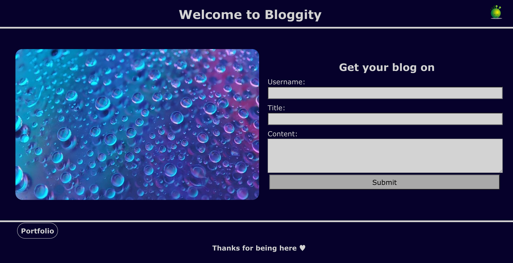
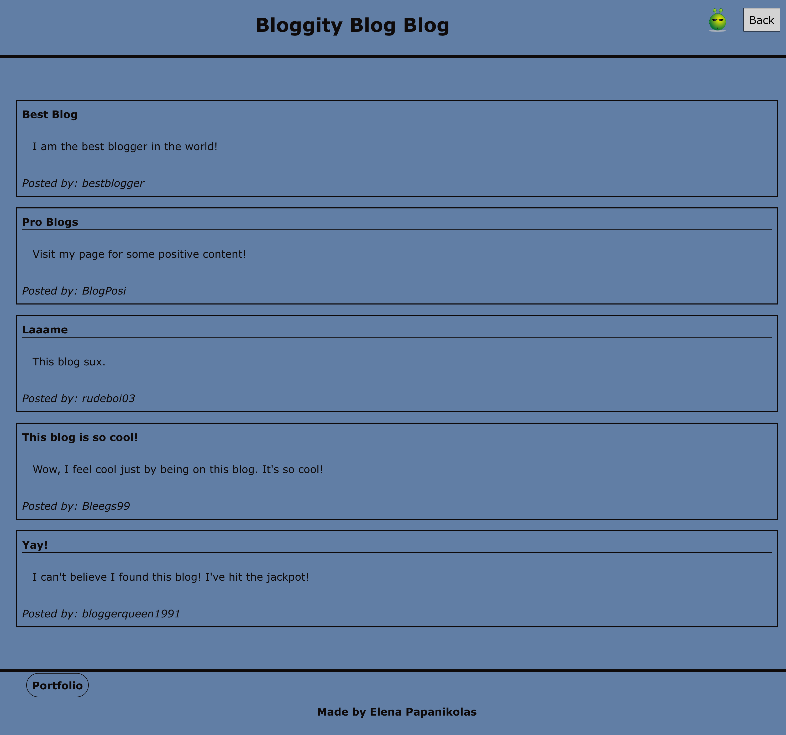

# Bloggity

## Description

For this project I was tasked with creating a two-page blog website from scratch. The first page is a landing page with a form where users enter their data to create the blog posts. Once they submit their data, they are taken to the second page, where their posts will display. The second page also contains a light/dark mode option, and a back button. This project proved quite difficult for me because I needed to use multiple files for HTML, CSS, and JavaScript, and link them all together in the correct way that allows them to talk to each other. Before any of the actual code writing, I wrote out and designed how I wanted my webpage to look like, using wire-framing. I first started with the basics of the HTMLs of the landing page and blog posts page, and styled what I could at that point, in CSS. Then in JavaScript, in form.js, I declared variables for the form inputs, created a function that displays the display message when the form isn't filled out all the way, and created the conditional statements that display different messages to the user when the form is missing a component. I had to add an event listener to that whole function. I also linked the blog.html page to the submit button. Next I created the back button for the blog posts page by creating a variable and then adding another event listener to it in blog.js. and linking it back to the index.html page. Then I created functions to store and retrieve the blog posts from local storage, in logic.js. After that I created a function to render the user generated blog posts to the page. Next I had to set attributes for the user generated elements, so I'd be able to style them in CSS. Then I had to create another event listener for the light and dark mode, in logic.js., and a function to set the light and dark themes to local storage. Overall, this project was challenging with writing the functions to target elements and using local storage.

## Installation

N/A

## Usage

The user is presented with a blog landing page. This page contains a form with labels and inputs for the user to enter their username, blog title, and blog content. If the user does not enter something for each input, they are presented with a message that prompts them to complete the form. When the user submits the form, their entered data is stored in local storage, and they are redirected to the blog posts page. The header of the blog posts page contains a light and dark mode option and a back button, that takes the user back to the landing page, and they are able to enter more blog posts. When the user clicks the light or dark mode option, the page content is styled to reflect the light or dark mode selection. The users preference is also stored in local storage, so even with they refresh or exit the page and come back, it is saved. After the user submits their blog posts, the posts are rendered to the posts page in top to bottom order of first written, to the latest written being at the bottom of the page. If you inspect the page with DevTools you will find a JSON array of blog post objects, including the post author's username, title, and content. In the footer you will find a link to my portfolio. 

### [Click here](https://elenapapanikolas.github.io/Bloggity/) for deployed application.

 ## Credits

Image by <a href="https://pixabay.com/users/andruino-10513081/?utm_source=link-attribution&utm_medium=referral&utm_campaign=image&utm_content=8203505">Andruino</a> from <a href="https://pixabay.com//?utm_source=link-attribution&utm_medium=referral&utm_campaign=image&utm_content=8203505">Pixabay</a>

Image by <a href="https://pixabay.com/users/clker-free-vector-images-3736/?utm_source=link-attribution&utm_medium=referral&utm_campaign=image&utm_content=41620">Clker-Free-Vector-Images</a> from <a href="https://pixabay.com//?utm_source=link-attribution&utm_medium=referral&utm_campaign=image&utm_content=41620">Pixabay</a>

Image by <a href="https://pixabay.com/users/clker-free-vector-images-3736/?utm_source=link-attribution&utm_medium=referral&utm_campaign=image&utm_content=41615">Clker-Free-Vector-Images</a> from <a href="https://pixabay.com//?utm_source=link-attribution&utm_medium=referral&utm_campaign=image&utm_content=41615">Pixabay</a>

## License 

N/A